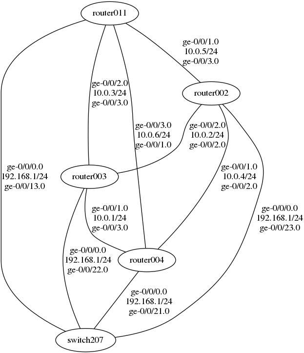
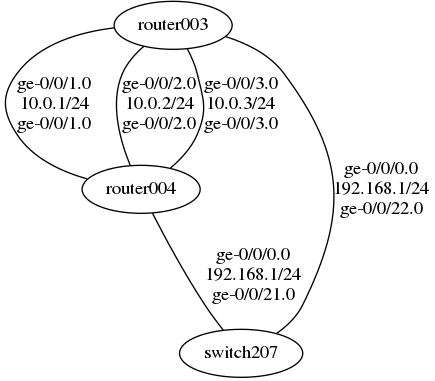
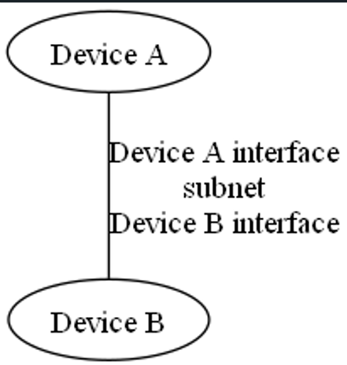

# LLDP Graph Visualization
LLDP Graph Visualization is a Python program for visualizing LLDP connectivity information.
- [Usage](#usage)
  - [Help](#help)
  - [Running script with input file](#running-script-with-input-file)
  - [Running script without input file](#running-script-without-input-file-uses-default-configuration)
- [Understanding ouput](#understanding-ouput)
## Usage
Use either python (if it points to python 3 version) or python3 depending on installation path for python.

### Help
```console
foo@bar:~$ python3 lldp_info.py -h
usage: lldp_info.py [-h] [-f FILE]

This program displays a graphical representation of a given
network.

options:
  -h, --help            show this help message and exit
  -f FILE, --file FILE  specify json file path where router
                        information is stored

Author: Diego Guzman
```

### Running script with input file
```console
foo@bar:~$ python3 lldp_info.py -f 'Json_files/network_config.json'
Initializing execution...

Establishing connection with ip 192.168.1.11...
Connection successful!
Enabling LLDP (Link-Layer Discovery Protocol)...
Successfully enabled LLDP!
Gathering LLDP connectivity information...
Successfully gathered LLDP connectivity information!

...
...
...

Displaying network graph...
```


Where the image is saved as network_graph.png and displayed on the screen.

### Running script without input file (uses default configuration)
```console
foo@bar:~$ python3 lldp_info.py
Initializing execution...

Establishing connection with ip 192.168.1.3...
Connection successful!
Enabling LLDP (Link-Layer Discovery Protocol)...
Successfully enabled LLDP!
Gathering LLDP connectivity information...
Successfully gathered LLDP connectivity information!

...
...
...

Displaying network graph...
```


Where the image is saved as network_graph.png and displayed on the screen.

## Understanding ouput
<strong>Ovals:</strong> devices' host-name are indicated inside the ovals.<br/>
<strong>Edges:</strong> the connections are represented by edges.<br/>
<strong>Edges_labels:</strong> located to the right of the connection, they indicate from top to bottom: the interface of the device on top, the subnet, and lastly the interface of the device on the bottom. An illustrative image of the format is shown below.


